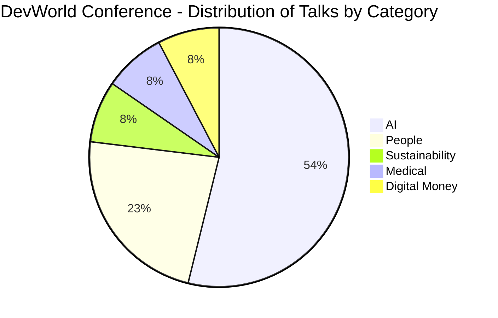
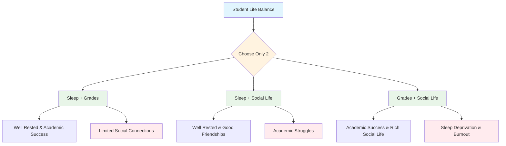
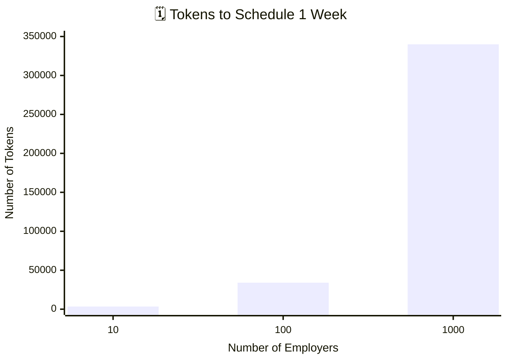

# DevWorld 2025
- [Back](../DevWorld.md)

## Stats

```mermaid
pie title DevWorld Conference - Distribution of Talks by Category
    "AI" : 7
    "People" : 3
    "Sustainability" : 1
    "Medical" : 1
    "Digital Money" : 1
```

## Life on the Spectrum: Creating Workplaces Where Neurodivergent Talent Thrives

```mermaid
graph TD
    A[Student Life Balance] --> B{Choose Only 2}
    B --> C[Sleep + Grades]
    B --> D[Sleep + Social Life]
    B --> E[Grades + Social Life]
    
    C --> C1[Well Rested & Academic Success]
    C --> C2[Limited Social Connections]
    
    D --> D1[Well Rested & Good Friendships]
    D --> D2[Academic Struggles]
    
    E --> E1[Academic Success & Rich Social Life]
    E --> E2[Sleep Deprivation & Burnout]
    
    style A fill:#e1f5fe
    style B fill:#fff3e0
    style C fill:#e8f5e8
    style D fill:#e8f5e8
    style E fill:#e8f5e8
    style C2 fill:#ffebee
    style D2 fill:#ffebee
    style E2 fill:#ffebee
```

## LLMs can't optimize schedules, but AI can!

```mermaid
xychart-beta
    title "🗓️ Tokens to Schedule 1 Week"
    x-axis "Number of Employers" [10, 100, 1000]
    y-axis "Number of Tokens" 0 --> 350000
    bar [3400, 34000, 340000]
```

